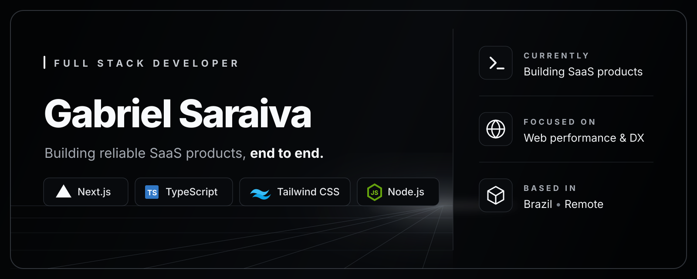

  

  
  
  

## About me

I'm a Full Stack Developer with 4+ years of experience building SaaS products. I work mostly with TypeScript, React, Next.js, and Node.js, and I'm comfortable owning features end to end, from the frontend to APIs, databases, authentication, and integrations.

## What I bring

<table>
  <tr>
    <td><strong>Product engineering</strong></td>
    <td>End-to-end ownership from product requirements to production delivery</td>
  </tr>
  <tr>
    <td><strong>SaaS architecture</strong></td>
    <td>Multi-tenancy, RBAC, webhooks, background jobs, and real-time flows</td>
  </tr>
  <tr>
    <td><strong>Trust &amp; reliability</strong></td>
    <td>Secure document handling, audit trails, idempotent payments, and testing</td>
  </tr>
  <tr>
    <td><strong>Integrations</strong></td>
    <td>AWS, Stripe, OpenAI/LLMs, Shopify, WhatsApp, email, identity, and screening services</td>
  </tr>
</table>

## Toolbox

**Frontend**

**Backend & data**

**Cloud, quality & delivery**

